# Dashi PPT Skill · 大師 PPT／網頁 PPT／可編輯 PPTX

<!-- zh-TW-fork -->
> **繁體中文（台灣）版本**：此 fork 的主要文件、Skill 指示、編輯介面、主題資料、Windows 腳本及預編譯執行檔採繁體中文。請從本儲存庫的 **main** 安裝；不要使用上游 npm 套件覆蓋。英文介面與相容性資料保留。

[English](README.en.md) · [繁體中文](README.md) · [在地化與維護說明](docs/zh-TW-localization.md) · [AGPL-3.0 授權](LICENSE)

把內容交給 AI Agent，產生可在瀏覽器編輯的簡報，再匯出 HTML、PDF 或可編輯的 PPTX。原有 **12 套視覺主題、1,020 個版型、8,576 個控制項**維持不變。

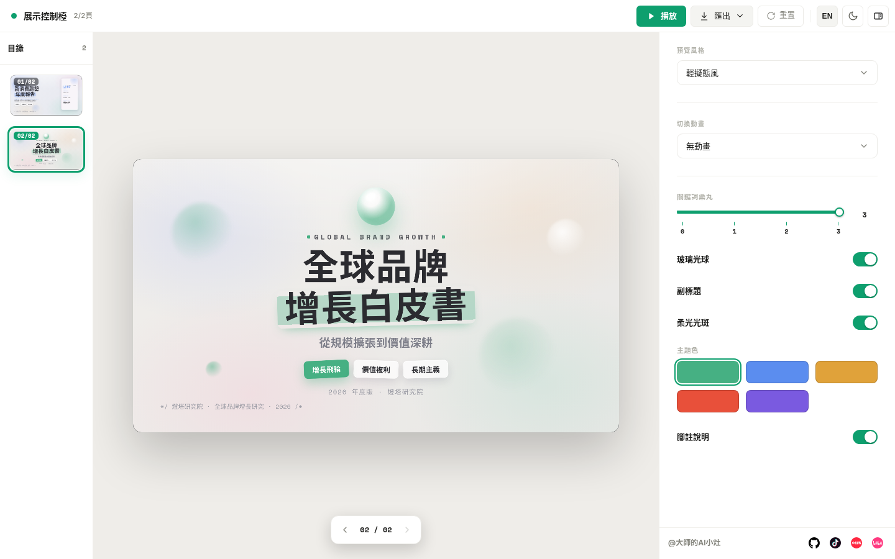

## 安裝繁體中文版本

```bash
git clone --branch main --single-branch https://github.com/staruphackers/master-ppt-skill.git
```

先備份既有 Skill，再將本專案的整個 `skills/dashi-ppt` 資料夾放入所用 Agent 的 Skill 目錄，重新開啟工作階段。請保留原始 clone，後續也從同一個 fork 更新。

**不要使用 `npx dashi-ppt-skill@latest` 安裝或更新這個版本**：該名稱指向上游 npm 套件，不包含本 fork 的繁中修改。本次沒有發佈新的 npm 套件。

環境需求：Node.js 20+、npm；匯出 PDF／PPTX 需要本機 Chrome／Chromium／Edge。首次執行會準備專案依賴。生成內容的模型額度由所用 Agent 方案決定，本 Skill 不附帶模型額度或付費 API。

### 更新

在原始 clone 中先確認 `git status`，保留自己的變更並備份安裝目錄，再於 `main` 執行：

```bash
git pull --ff-only origin main
```

更新後重新複製 `skills/dashi-ppt`。有本機修改或非快轉更新時，先處理差異，不使用強制推送或直接覆蓋。版本檢查不會再推薦上游 npm 更新。

## 使用流程

1. 告訴 Agent 主題、受眾、頁數、內容與主要結論，指定使用 `dashi-ppt`。
2. 選擇主題，確認圖片／影片需求；預設中文文案使用台灣繁體中文。
3. 產生 HTML 簡報，在瀏覽器改文字、換媒體、調版型與配色。
4. 驗收內容後，匯出需要的格式。

範例：

```text
使用 dashi-ppt，將這份內容製作為 10 頁繁體中文簡報。
受眾是企業主管，保留原始數字與來源，不新增未提供的事實。
先展示可選主題，完成後交付可編輯 HTML 與 PPTX。
```

## 功能

- **版型與分析工具**：封面、目錄、指標、趨勢、比較、流程、風險與結尾；含 SWOT、波特五力、PEST、商業模式圖等。
- **圖表**：雷達圖、瀑布圖、矩形樹圖、漏斗圖、熱圖、桑基圖、甘特圖等。
- **編輯器**：直接改字、拖曳替換媒體、調整控制項、切換配色與明暗模式、重排／跳過／刪除／複製頁面。
- **匯出**：HTML 離線包、PDF、可編輯 PPTX；HTML 的動畫與部分視覺效果不保證等同 PowerPoint。

適合產業研究、競品分析、趨勢報告、企業提案、品牌介紹與內部訓練。不以逐像素客製設計為目標。

## 12 套內建視覺主題

以下圖片由本 fork 的繁中版實際渲染並擷取，不再嵌入上游簡體示範 GIF。每張只代表抽測版型，並非全部版型均經人工視覺審查。

| 主題 | 繁體中文實際畫面 |
|---|---|
| theme01｜輕擬態風 | 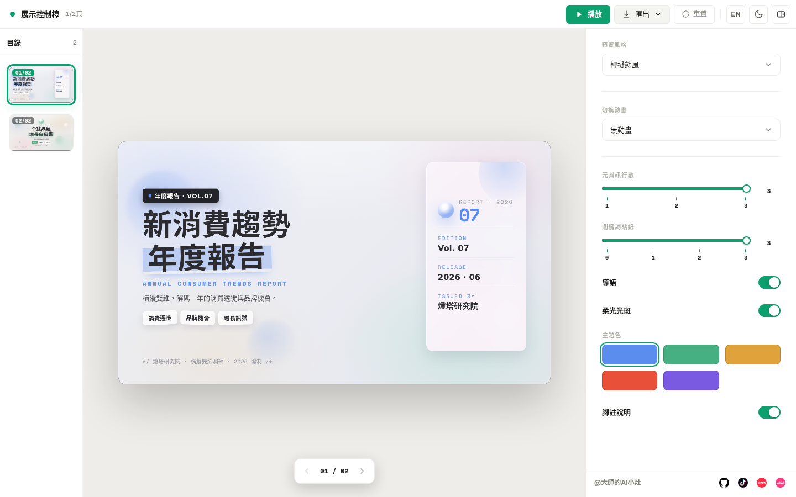 |
| theme02｜炫光紫綠風 | 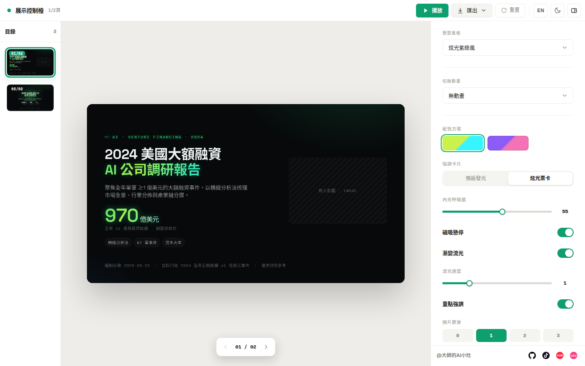 |
| theme03｜深淺程式碼風 | 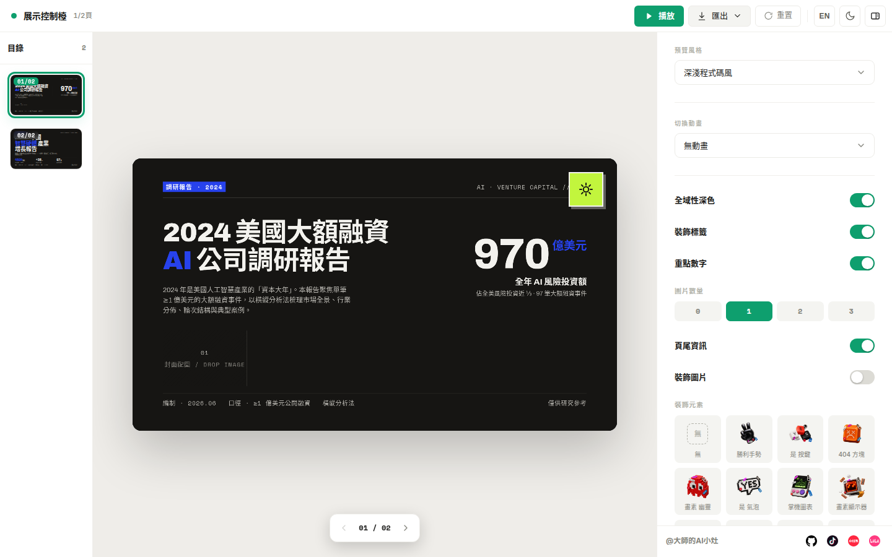 |
| theme04｜玻璃糖果風 | 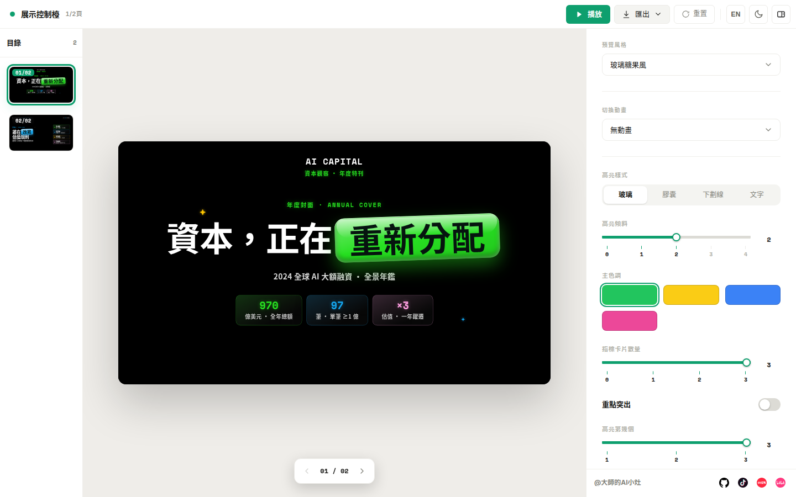 |
| theme05｜色譜圖表風 | 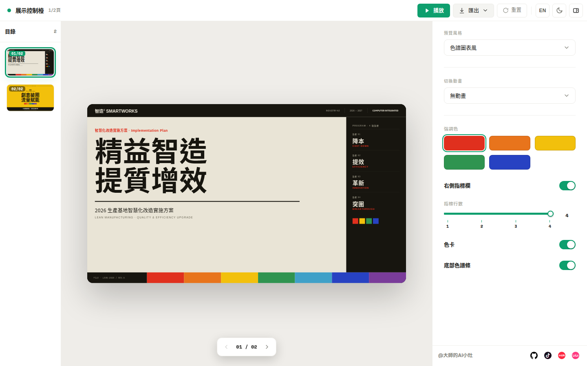 |
| theme06｜深色圖譜風 | 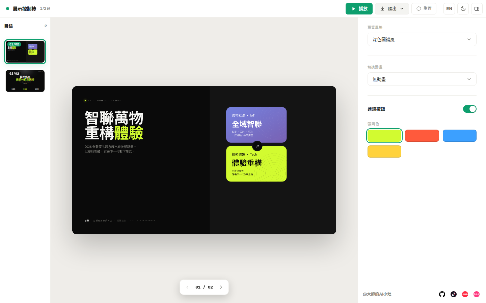 |
| theme07｜冷白調研風 | 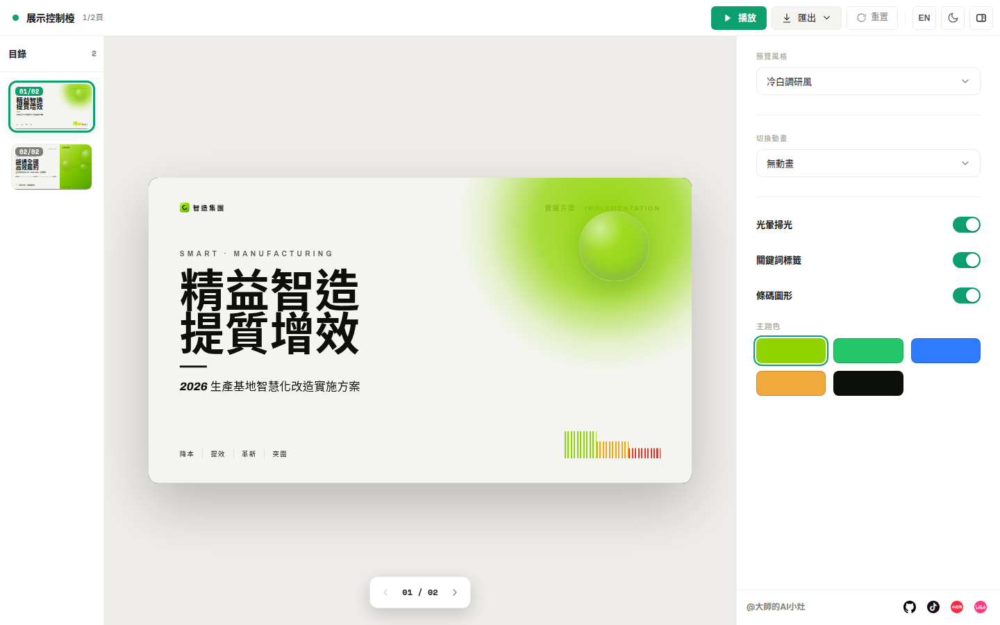 |
| theme08｜黑金實驗風 | 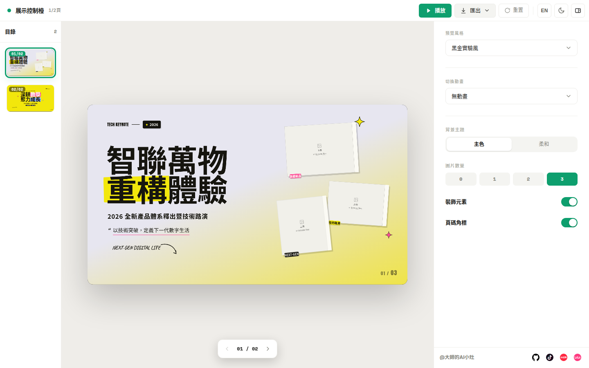 |
| theme09｜深藍雜誌風 | 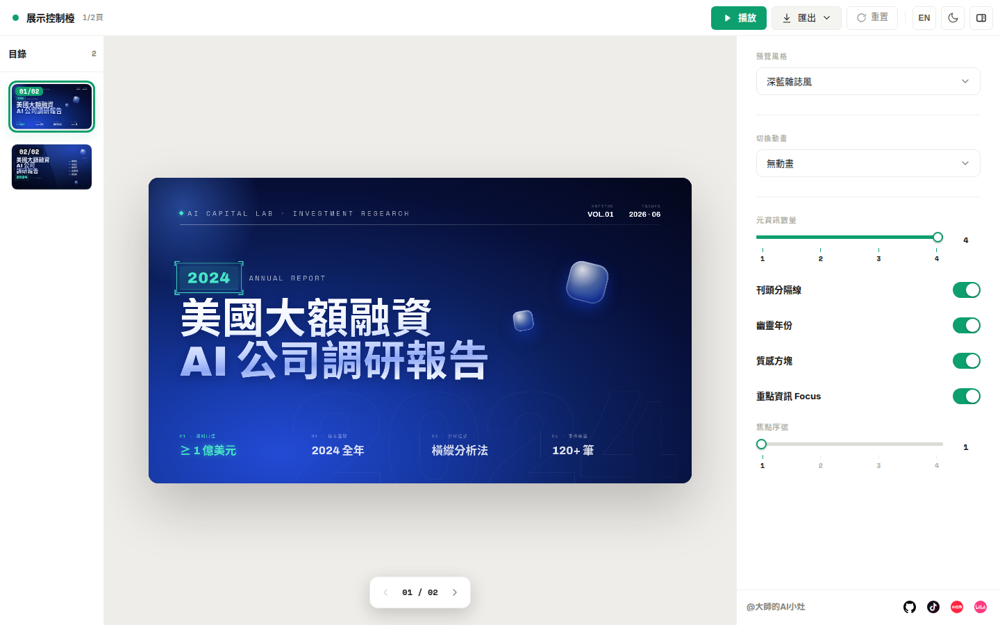 |
| theme10｜金色指數風 | 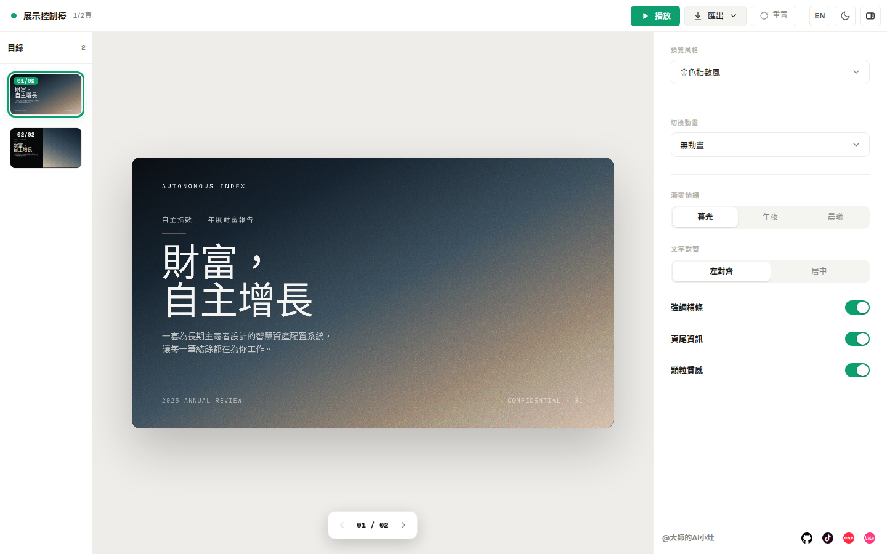 |
| theme11｜高能增長風 | 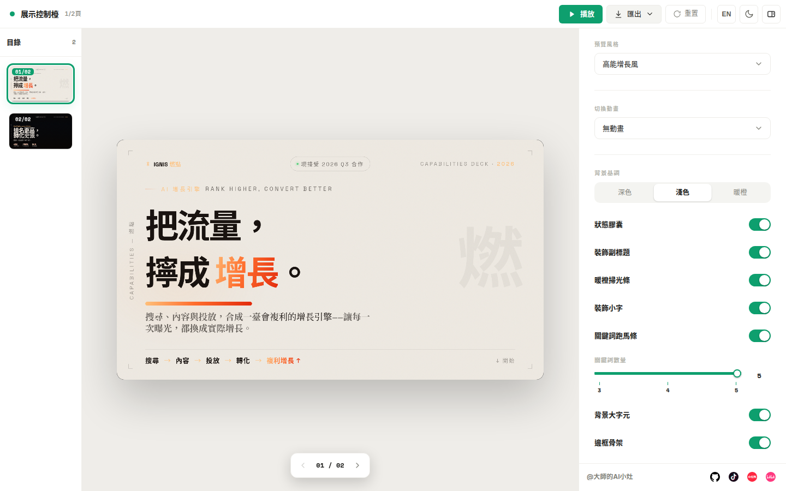 |
| theme12｜聲波霓虹風 | 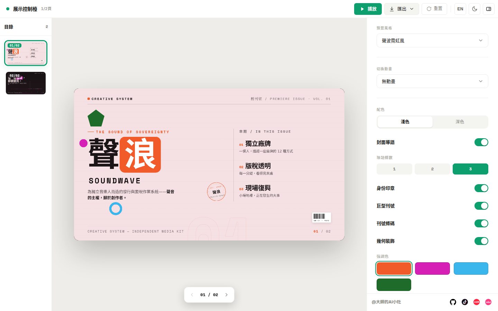 |

## 匯出

```bash
npm --prefix <project目錄> run export:pptx -- <含index.html的簡報目錄> <輸出.pptx>
npm --prefix <project目錄> run export:pdf -- <含index.html的簡報目錄> <輸出.pdf>
```

`project目錄` 指 `skills/dashi-ppt/project`；路徑有空白時請加上引號。不要將不信任的 HTML、外部 URL 或素材交給本機匯出服務。預覽與匯出服務僅建議綁定本機，不應直接公開到網際網路。

## 語言與相容性

文件、預設中文內容與介面採台灣繁體中文；英文介面與語言切換保留。內部中文代碼仍使用 `zh`，HTML 標記為 `zh-TW`。套件名稱、CLI 參數、英文識別名稱、版型 key、schema 與授權不變。

原始簡體字典鍵、簡繁比對規則及測試輸入會保留，以免舊資料或英文翻譯失效；它們不是使用者可見的漏翻。英文 README 保留並標明上游歷史示範素材；歷史 Git 提交與第三方商標不重寫。

## 驗證與維護

[繁中維護說明](docs/zh-TW-localization.md) 說明轉換範圍與回復方式。首次轉換的逐檔記錄見 [原始稽核報告](docs/zh-TW-localization-report.json)。瀏覽器、PowerShell 語法及 PPTX／PDF 匯出結果由 GitHub Actions 留存，沒有證據的檢查不宣稱通過。

## 授權與致謝

基於 [chuspeeism/dashi-ppt-skill](https://github.com/chuspeeism/dashi-ppt-skill) 修改，保留原作者及第三方著作權資訊。依 [GNU AGPL-3.0](LICENSE) 授權；本 fork 的翻譯與維護不變更原授權。使用或散布前請閱讀授權原文。
